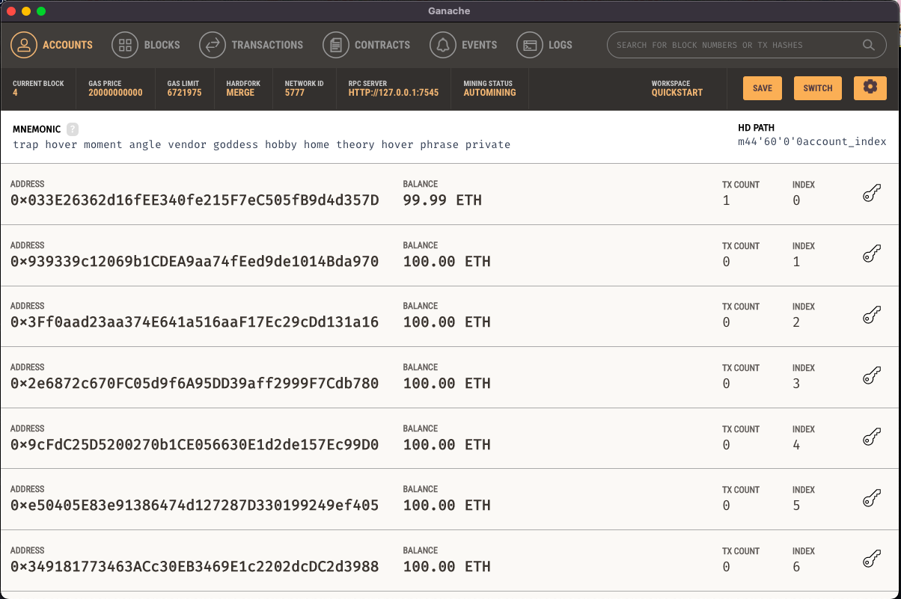
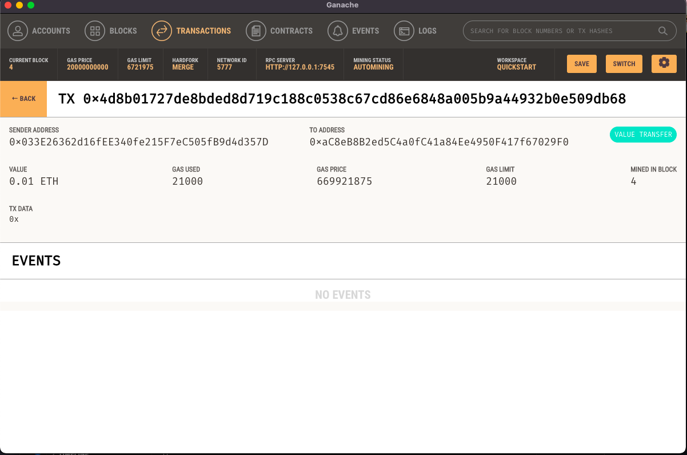

## Cryptocurrency Wallet

### Background

Scenario: A startup that is building a new and disruptive platform called KryptoJobs2Go. KryptoJobs2Go is an application that its customers can use to find fintech professionals from among a list of candidates, hire them, and pay them. As KryptoJobs2Go’s lead developer, we have integrated the Ethereum blockchain network into the application in order to enable our customers to instantly pay the fintech professionals whom they hire with cryptocurrency.

## File

[Application code](krypto_jobs.py)
[Backend code for crypto wallet](crypto_wallet.py)

## Result/Summary
>KryptoJobs2Go Application Screen

>Ganache Account screenshot post transaction

>Ganache Transaction screenshot post transaction

